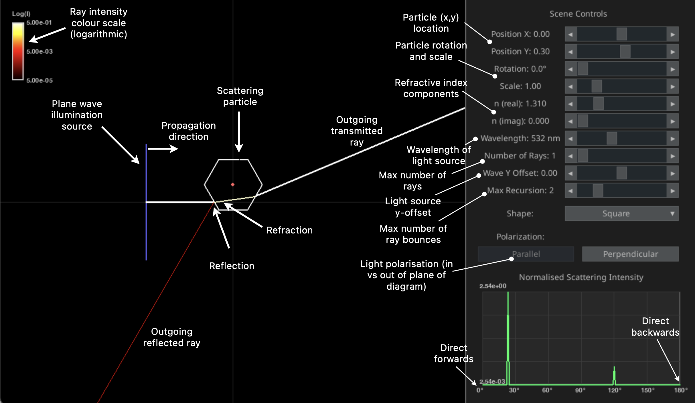
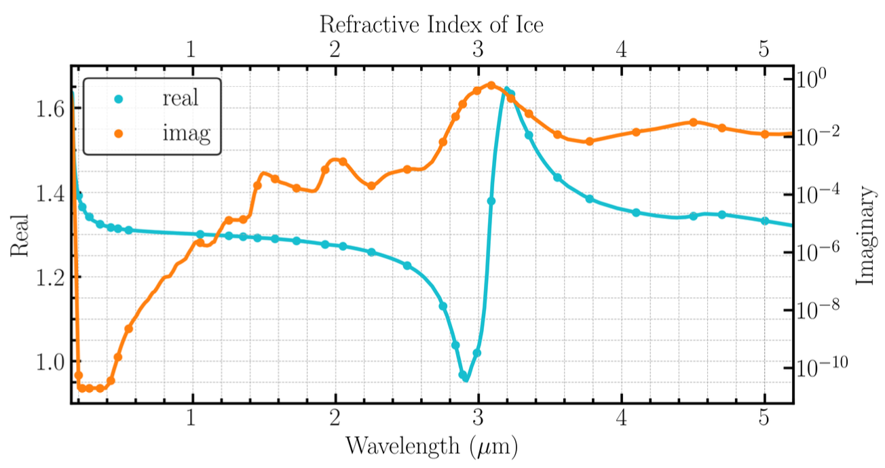
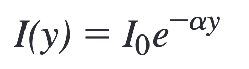
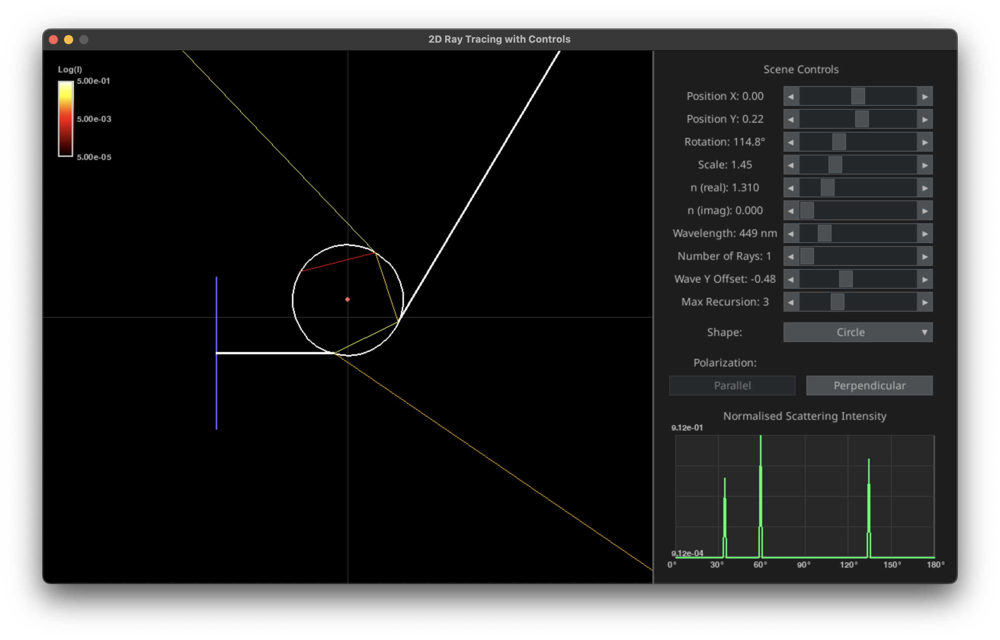

# 2D Ray Tracing App

- 2D ray tracing simulation with real Physics:
  - Snell's Law at interfaces.
  - Fresnel equations for reflection and transmission.
  - Parallel and perpendicular polarisation.
  - Phase function (normalised scattering intensity) plot.

# How to Use

- Go to the [releases](https://github.com/hballington12/rt-sim-2d/releases) page to download the zip file.
- Unzip and allow permissions for the app to run on your device.
- After a few seconds, the app should launch.

# Basic Controls

# Exercies

## 1. Basics

Initially, the app is set up to simulate a single ray through a symmetric hexagonal scatterer. The maximum ray recursion depth (max. number of ray bounces) is set to 2. The phase function (normalised scattering intensity) is shown in the bottom right. Investigate how the following parameters affect the scattering of the ray:
  - Particle X and Y location
  - Particle rotation
  - Particle scale
  - Wavelength of light
  - Maximum recursion depth

## 2. Refractive index

The optical properties of real particles in nature are wavelength-dependent. In other words, the refractive index is a function of the wavelength of light. For example, the figure below shows the refractive index of ice from 0.5 to 5 microns:

Investigate how the following parameters affect the scattering of the single ray:
  - Refractive index real component
  - Refractive index imaginary component
  - Wavelength of light
  - Particle scale

Absorption in a homogeneous (uniform) medium is described by Beer's law, which predicts an exponential decay of intensity with distance:

*Where I_0 is the initial intensity, y is distance travelled by the ray, and alpha = constant * refr-index-imag / wavelength

- With this in mind, explain the results that you found for the 4 parameters above.

## 3. Multiple rays

Fundamentally, light behaves as a wave, but geometric optics allows us to model the propagation as rays, as long as the particle is much larger than the wavelength. However, we still need to trace enough rays to get an accurate depiction of all possible scattering paths. Choose a different particle shape from the dropdown menu and increase the number of rays. Keep the max recursion depth at 2.

- For each outgoing scattered ray, can you observe its contribution to the phase function (normalised scattering intensity) plot?
- Does the number of peaks in the phase function vary with the number of rays?
- How many rays are needed to accurately represent the scattering of light, and how does it vary with particle shape?

## 4. Rainbow Angle

Set the refractive index back to 1.31 + 0i, which is approximately the refractive index of water at visible wavelengths. Change the shape to a circle and set the number of rays back to 1. Increase the maximum number of recursions to 3. Then vary the Wave Y Offset to produce a ray that refracts approximately along a scattering angle of 180 - 42 = 138°, as shown here:

For red light (wavelength 750 nm, n = 1.330), the scattering angle is about 137.5°.
- For blue light (wavelength 350 nm, n = 1.343), is the scattering angle greater than or less than 137.5°?

(Note that the simulation is not so accurate since the circle shape is really just a polygon with 30 sides.)

## 5. Extension

Set the shape back to something other than a circle. Set the light polarisation to parallel (ie. the electric field lies in the plane of the diagram and is perpendicular to the ray direction). Set the max recursion value to 1 (just external reflection).
- Vary the shape location and rotation to find the angle where no light is reflected from the surface.
- What angle do you find, and how does it vary with refractive index?
- Use a search engine to find the name of this angle.
